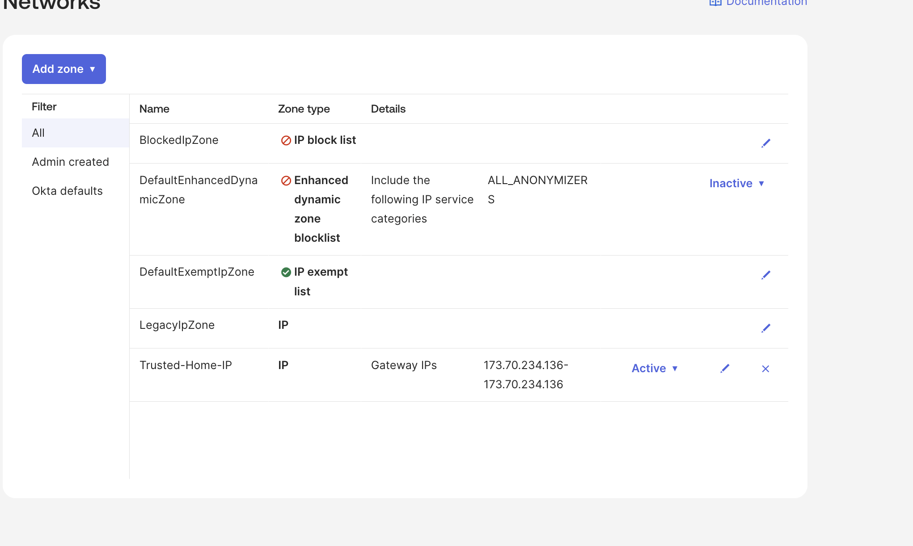
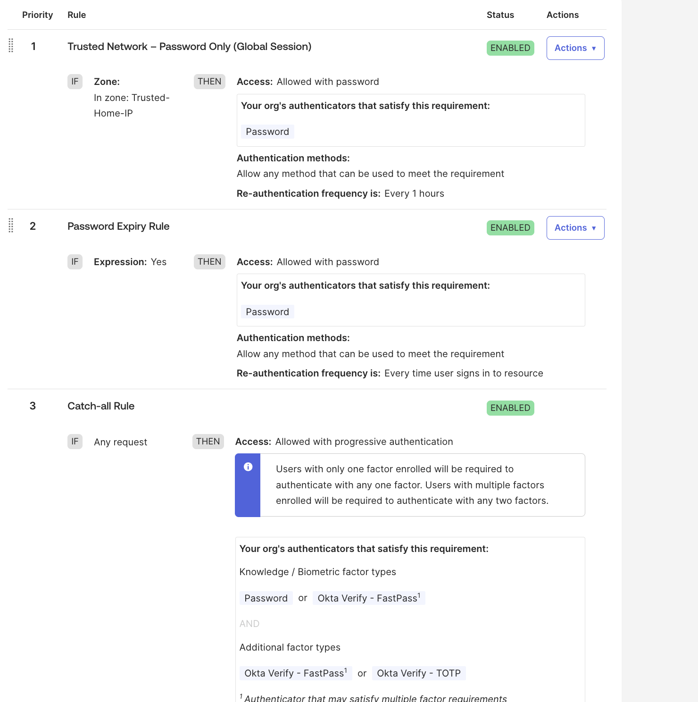
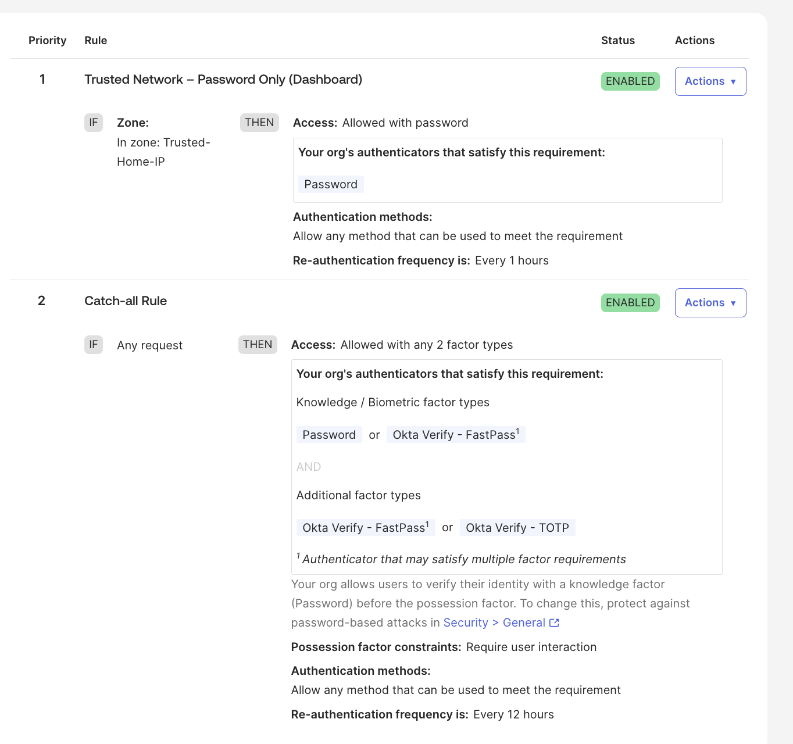
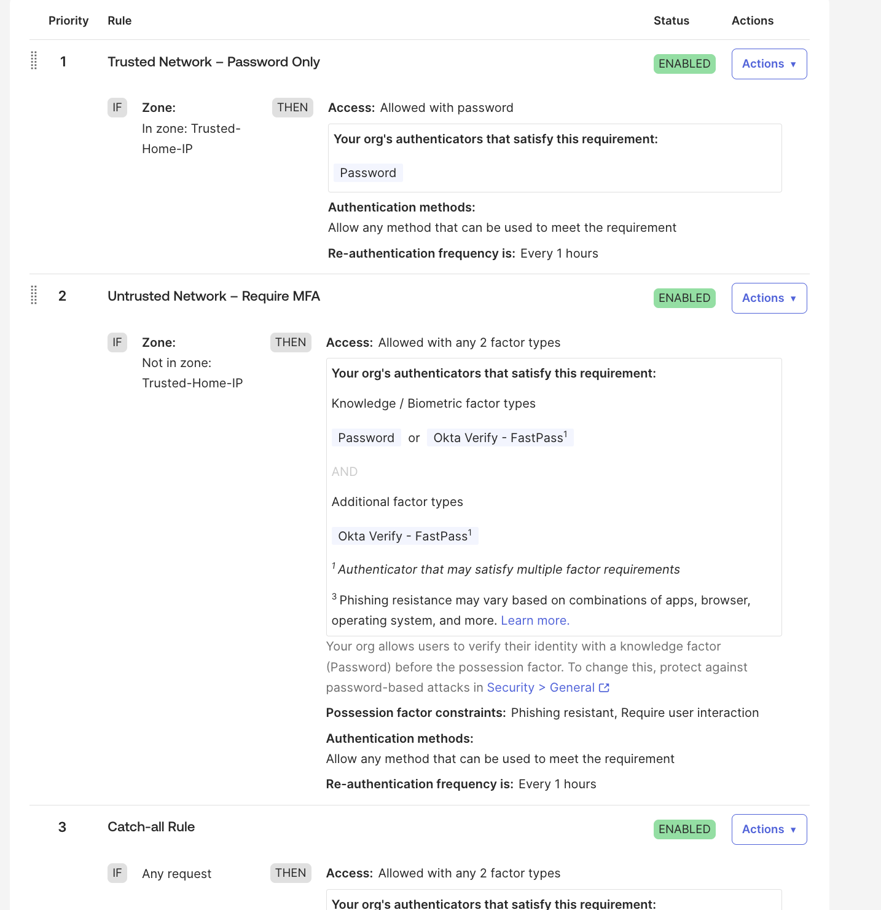

# 🔐 Okta Conditional Access & Adaptive MFA Lab

## Overview

This lab demonstrates implementation of adaptive conditional access controls in **Okta Identity Engine** using:

- IP Network Zones
- Global Session Policies
- App Sign-In Policies
- Layered Authentication Rules
- Context-Aware MFA Enforcement

The objective was to implement a Zero Trust authentication model where:

- ✅ Trusted network → Password-only authentication
- 🔒 Untrusted network → Multi-factor authentication (MFA)

This mirrors real-world enterprise identity security architecture.

---

## Architecture Summary

Authentication flow:

AWS Portal → Redirect to Okta → Global Session Policy → App Policy → Access Granted

Policy Layers:

1. Global Session Policy (establishes Okta session)
2. Okta Dashboard App Policy
3. AWS IAM Identity Center App Policy

All layers must align for conditional access to function correctly.

---

User → AWS Portal → Okta (Global Policy) → Okta Dashboard Policy → AWS App Policy
             ↓
        Trusted / Untrusted
             ↓
      Password-only / MFA

---

## Configuration Steps

### 1️⃣ Network Zone Creation

Created a Trusted IP Zone:

- Zone Name: `Trusted-Home-IP`
- IP Added: Public home IP address
- Used for conditional authentication decisions

📸 Screenshot:

---

### 2️⃣ Global Session Policy

Created rule:

**Trusted Network – Password Only (Global Session)**

IF:
- User IP is in `Trusted-Home-IP`

THEN:
- Access allowed after successful authentication
- User must authenticate with: Password

Catch-all rule:
- Requires MFA for all other IPs

📸 Screenshot:

---

### 3️⃣ Okta Dashboard App Policy

Applied the same conditional logic to the Okta Dashboard app to ensure:

- Trusted IP → Password only
- Untrusted IP → MFA required

📸 Screenshot:

---

### 4️⃣ AWS IAM Identity Center App Policy

Configured AWS app-level authentication:

Trusted rule:
- IP in `Trusted-Home-IP`
- Password required

Untrusted rule:
- Any other IP
- Requires two factors

📸 Screenshot:

---

## Validation

### ✅ Trusted Network Login

From Trusted IP:

- Password prompt only
- No MFA challenge
- Access granted

📸 Screenshot:

---

### 🔒 Untrusted Network Login

After removing IP from trusted zone:

- Password required
- Okta MFA challenge triggered
- Two-factor authentication enforced

📸 Screenshot:

---

## Security Concepts Demonstrated

- Zero Trust authentication model
- Context-aware access control
- Network-based policy enforcement
- Layered authentication evaluation
- Identity Engine policy precedence
- MFA escalation based on risk context
- Separation of global session vs app policy logic
- Real-time policy debugging using System Log

---

## Key Lessons Learned

- Okta evaluates Global Session policies before App policies.
- Okta Dashboard sign-in policy can override app-level behavior.
- All authentication layers must align for conditional access to work.
- System Log is essential for identifying which rule matched.
- Rule ordering determines enforcement outcome.

---

## Outcome

Successfully implemented adaptive authentication using:

- Network zones
- Global session controls
- App-specific authentication rules
- Conditional MFA enforcement

This lab demonstrates real-world enterprise conditional access architecture within Okta Identity Engine.

---

## Technologies Used

- Okta Identity Engine
- Okta Network Zones
- Okta Authentication Policies
- AWS IAM Identity Center (for validation testing)

---

## Author

Brianna Wandt  
Identity & Access Management Portfolio Lab
